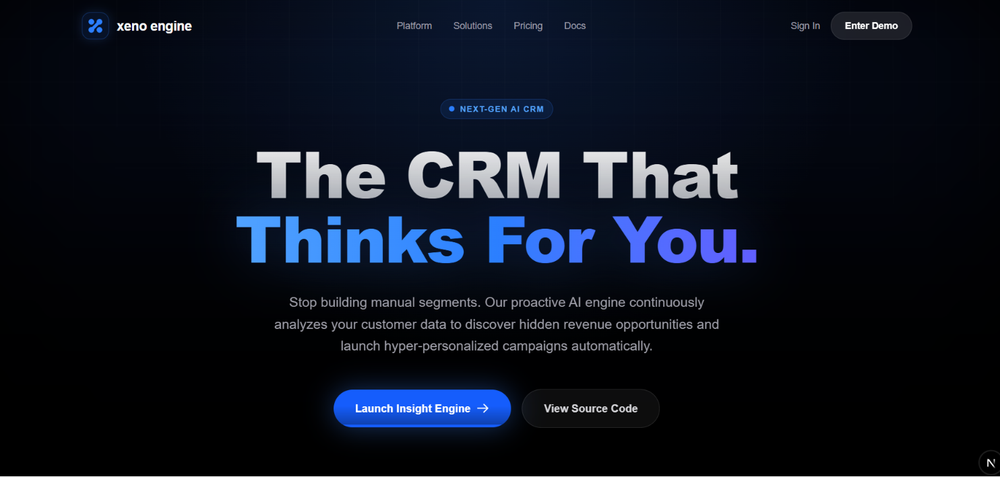

# Xeno AI-Native Mini CRM 🚀

Welcome to the **Xeno AI-Native Mini CRM** — an intelligent, proactive marketing platform built to help consumer brands segment their audiences, run automated campaigns, and visualize delivery metrics in real time.

This project was built for the **Xeno Engineering Take-Home Assignment**. It explores a bold, opinionated take on an "AI-Native" workflow where the AI acts as a *Proactive Co-Marketer* rather than a simple chatbot, constantly surfacing actionable campaign insights directly to the user.

---

## 🌟 Key Features

1. **Insight Engine (Proactive AI)** 
   - A deep-space dashboard that automatically analyzes your customer database using Google Gemini (with an automatic local mocking fallback) to discover high-value segments and generate actionable campaign recommendations.
   
2. **Audience Directory**
   - A highly responsive, glassmorphic CRM interface to browse your customer base. 
   - Features URL-synchronized state for searching and tagging, dynamic pagination, and robust widescreen support that seamlessly shifts from 2, to 3, to 4-column layouts.

3. **Campaign Control Center**
   - An intuitive campaign creation and tracking interface.
   - Includes real-time delivery tracking utilizing simulated asynchronous webhooks to track exactly when messages are Delivered, Opened, Clicked, or Failed.

4. **Mobile-First UX**
   - Built with deep empathy for mobile interaction. Features include top-down dropdown menus, swipeable insight carousels, two-tap email copy interactions (to bypass the lack of hover states), and auto-cycling customer segment tags.

---

## ✅ Fulfilling the Assignment Requirements

Here is exactly how this submission hits every requirement in the brief:

1. **Ingest Data:** We take in customers and orders through a dedicated `/api/ingest` endpoint. (Note: A robust `npx prisma db seed` script is included to generate 5,000 realistic customers so the AI has a massive dataset to analyze immediately).
2. **Segment Shoppers:** Instead of a manual query builder, the **Proactive AI Engine** securely analyzes the database and generates structured audience segments (using Zod validation), doing the heavy lifting for the marketer.
3. **Send Personalized Communications:** When a campaign executes, the payload is asynchronously handed off to the `/api/channel-stub/send` endpoint, which accurately mimics network delays.
4. **Surface Performance Insights:** The `/campaigns` dashboard features a live delivery funnel (Sent → Delivered → Opened → Clicked), powered by asynchronous webhooks firing back to `/api/webhooks/receipts`.
5. **AI-Native:** The AI is not bolted on as a chatbot. It is the primary engine of the platform, continuously and proactively surfacing actionable marketing campaigns based on live data.

---

## 🛠 Tech Stack & Architecture

- **Framework:** Next.js 15 (App Router)
- **Styling:** TailwindCSS (Premium dark-mode liquid glass aesthetic)
- **Database:** SQLite managed via Prisma ORM
- **AI Integration:** Vercel AI SDK interfacing with Google Gemini 
- **Deployment:** Ready for Vercel & Edge deployment

For a deep dive into the technical tradeoffs, database schemas, and architectural choices made during this build (including why we used Server Components, Prisma 7 Driver Adapters, and Webhook polling), please read the [Architecture Decisions Log](./ARCHITECTURE_DECISIONS.md).

You can also view the full history of iterations and polish in the [Changelog](./CHANGELOG.md).

---

## 🚀 Getting Started

### 1. Install Dependencies
Clone the repository and install the required packages:
```bash
npm install
```

### 2. Set Up the Database
Generate the Prisma client and push the SQLite schema:
```bash
npx prisma generate
npx prisma db push
```

### 3. Seed the Database
Populate the database with realistic fake customers, orders, and historical campaigns so the AI has data to analyze:
```bash
npm run seed
```

### 4. Configure AI (Optional)
If you want to use the live AI engine, create a `.env` file in the root directory and add your Google Gemini API key. 
If you skip this step, the app will safely fall back to a "Mock AI" mode, allowing you to test the UI without rate limits!
```env
GOOGLE_GENERATIVE_AI_API_KEY=your_api_key_here
```

### 5. Start the Development Server
Launch the Next.js server locally:
```bash
npm run dev
```
Open [http://localhost:3000](http://localhost:3000) in your browser to see the result!
